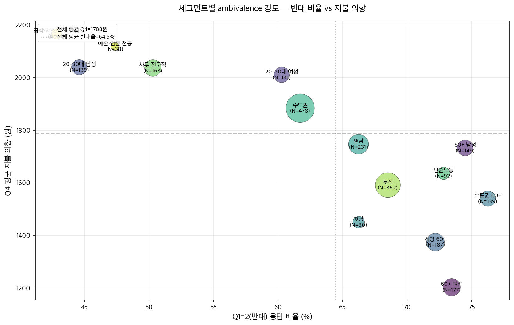
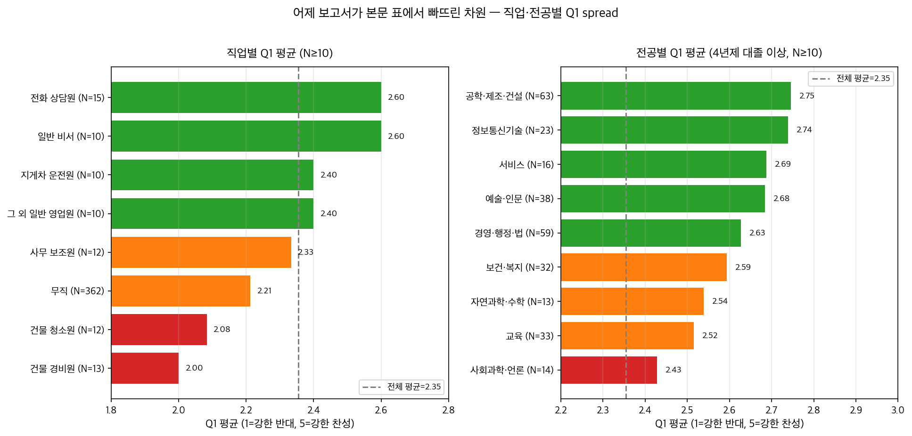
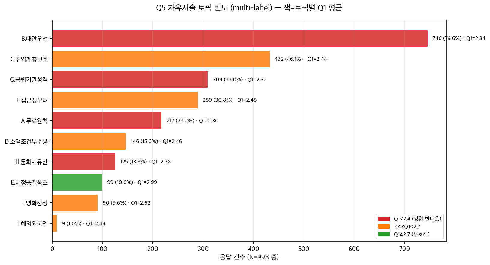
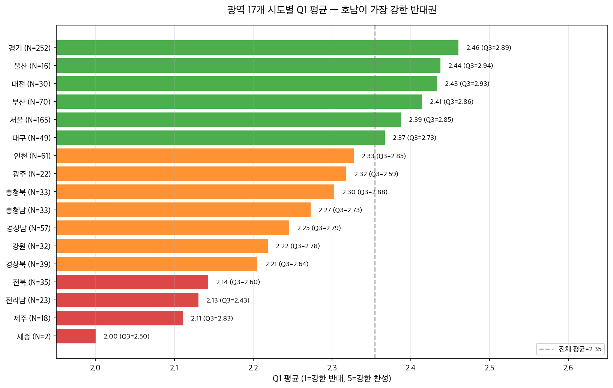
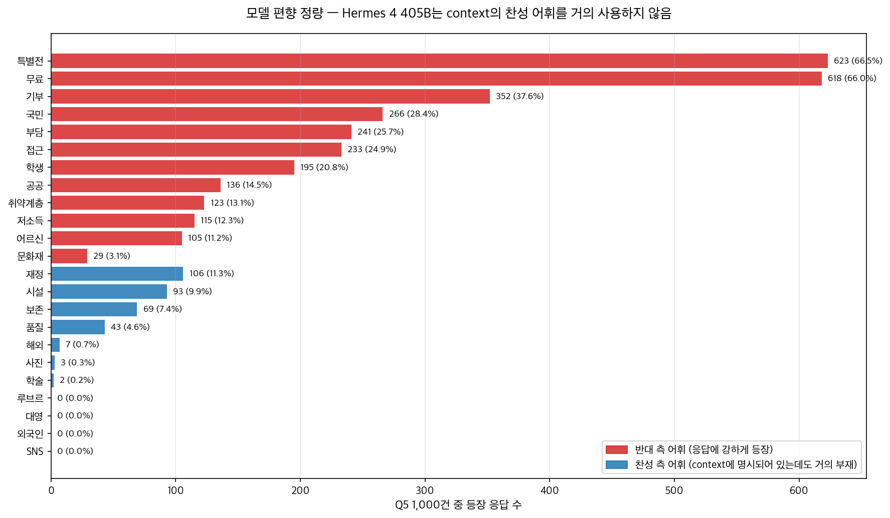

# 인사이트 보충 분석 — N=1,000 박물관 입장료 시뮬레이션

**작성일**: 2026-05-02
**대상**: `frontend/data/run_N1000_museum-admission-free/result.csv`
**원본 보고서**: 같은 폴더의 `report.md`(2026-05-01 18:45~20:00 KST 워커 자동 생성, 분석 LLM = Grok 4.20)
**본 문서의 위치**: 원본 큐레이터용 보고서를 그대로 두고, 그 옆에 분석가·연구자용 supplement로 첨부. 어제 보고서가 정성적으로 묘사한 가설을 정량 근거로 뒷받침하고, 어제 보고서가 사용하지 않은 차원(직업·전공·가족형태·시군구·narrative)에서 추가 신호를 추출.

---

## 한눈에 보는 차트 5종

---

## 0. 요약 — 어제 보고서가 놓친 신호 5개

1. **직업·전공 차원이 학력 차원보다 더 선명하다.** 같은 4년제 대졸 안에서도 공학·제조·건설 전공은 Q1 평균 2.75인 반면 사회과학·언론 전공은 2.43, 단순 학력으로 묶인 어제 보고서는 이 0.32 spread를 통째로 잃었다.
2. **"반대 + 소액 수용" 패턴은 ambivalence가 아니라 거의 보편적 입장이다.** Q1=1~2(반대) 638명 중 무료를 고른 사람은 27명(4.2%)뿐. 96%가 "반대하지만 1,000~3,000원은 낸다"는 동일 답형. 이건 ambivalence라기보다 **"원칙적 반대 + 실용적 소액 수용"이라는 단일 입장**으로 보는 편이 정확하다.
3. **수도권 60+가 지방 60+보다 반대율이 더 높다.** 어제 보고서가 "지방 접근성 우려"를 강조했지만, Q1=2 비율은 수도권 60+ 76.1% > 지방 60+ 72.2%. 다만 Q4 평균 지불 의향은 수도권 60+(1,540원) > 지방 60+(1,374원) — **수도권 고연령은 "원칙은 강하지만 돈은 더 쓸 수 있는" 패턴**.
4. **호남이 가장 강한 반대권이다.** 광역 17개 중 Q1 평균 최저 3개가 전라남(2.13) · 제주(2.11) · 전북(2.14). Q3(취약계층 면제 시 입장 변화)에서도 전라남 평균 2.43으로 최저 — **면제 단서를 줘도 입장이 잘 바뀌지 않는 그룹**.
5. **모델이 context의 찬성 어휘를 거의 사용하지 않았다.** Q5 1,000건에서 "루브르"·"대영"·"외국인"·"SNS" 각 0건, "사진" 3건, "해외" 7건. 반면 "특별전" 66.5%, "기부" 37.6%, "취약계층/저소득/어르신/학생" 합산 약 60%. **사회적 바람직성 편향이 단순 추측이 아니라 어휘 빈도로 확정된다**.

---

## 1. ambivalence 정량화 — 어제 보고서 "발견 02"의 정확한 수치

어제 보고서 발견 02는 "Q1=2 응답자 중 70~87%가 Q4=1,000~3,000원"으로 cluster별 범위만 제시했고, 전체 cross-tab 표를 본문에 넣지 않았다. 본 분석은 N=936 전체 cross-tab을 산출한다.

### Q1 band × Q4 cross-tab (count)

| Q1 band | 무료여야 한다 | 1,000원 미만 | 1,000~3,000원 | 3,000~5,000원 | 합계 |
|---|---:|---:|---:|---:|---:|
| 반대(1~2) | 27 | 112 | 499 | 0 | 638 |
| 중립(3) | 0 | 3 | 224 | 2 | 229 |
| 찬성(4~5) | 0 | 0 | 57 | 12 | 69 |
| 합계 | 27 | 115 | 780 | 14 | 936 |

### Q1 band 안의 % 분포

| Q1 band | 무료여야 한다 | 1,000원 미만 | 1,000~3,000원 | 3,000~5,000원 |
|---|---:|---:|---:|---:|
| 반대(1~2) | 4.2% | 17.6% | 78.2% | 0.0% |
| 중립(3) | 0.0% | 1.3% | 97.8% | 0.9% |
| 찬성(4~5) | 0.0% | 0.0% | 82.6% | 17.4% |

**해석**: 반대 응답자 638명 중 95.8%가 "받지 말아야 하지만 받는다면 얼마는 낼 수 있다"는 입장. 이건 모순이라기보다 **"기본 무료 원칙 + 특별전 유료 + 기부 확대 우선" 합의 위에 깔린 단일 답형**으로 보는 게 맞다. 큐레이터의 의사결정에 핵심: 반대 표심을 "유료화 절대 불가"로 읽으면 안 되며, "기본 무료 라인을 지키는 한 소액 참여는 가능"으로 읽어야 한다.

### Q4 옵션 anchoring 의심

옵션 6개(무료/1,000원 미만/1,000~3,000원/3,000~5,000원/5,000~10,000원/10,000원 이상) 중 5,000~10,000원·10,000원 이상은 **1,000명 중 0건**. 모델이 컨텍스트의 찬성 논거에 명시된 "1만~3만 원" 해외 수준을 거의 흡수하지 않고 한국 입장료 통념(1~3천 원) 안에 머무름. 이건 답변자(시뮬된 시민)의 실제 의향이라기보다 모델의 어휘 priors일 가능성이 크다.

---

## 2. 어제 보고서가 사용하지 않은 차원 — 직업·전공·가족형태·주거형태

어제 보고서 본문 표는 "수도권/비수도권 / 연령대 / 학력 / 성별 / 혼인 상태" 5개 차원. 페르소나 마스터에는 추가로 occupation, bachelors_field, family_type, housing_type, district이 있다. 모두 N=937 valid 응답 기준 Q1 평균을 다시 잘랐다.

### 2.1 occupation 차원 (n≥10)

| 직업 | n | Q1 평균 | Q3 평균 |
|---|---:|---:|---:|
| 일반 비서 | 10 | 2.60 | 2.80 |
| 전화 상담원 | 15 | 2.60 | 2.93 |
| 그 외 일반 영업원 | 10 | 2.40 | 2.80 |
| 지게차 운전원 | 10 | 2.40 | 3.00 |
| 사무 보조원 | 12 | 2.33 | 2.67 |
| **무직** | 362 | 2.21 | 2.71 |
| 건물 청소원 | 12 | 2.08 | 2.75 |
| 건물 경비원 | 13 | 2.00 | 2.92 |

직업군별 spread가 0.60(2.00→2.60). **단순 노동·경비·청소가 가장 강한 반대**, 사무직 여성층이 상대적으로 가장 우호적. 어제 보고서가 직업 차원을 본문에서 빼고 인용 사례에서만 언급한 것은 통계적 차원으로 활용할 만한 신호를 묻어둔 셈이다.

### 2.2 bachelors_field 차원 (4년제 대졸 이상 대상)

| 전공 | n | Q1 평균 | Q3 평균 |
|---|---:|---:|---:|
| 공학·제조·건설 | 63 | 2.75 | 3.03 |
| 정보통신기술 | 23 | 2.74 | 3.00 |
| 서비스 | 16 | 2.69 | 3.12 |
| **예술·인문** | 38 | 2.68 | 3.00 |
| 경영·행정·법 | 59 | 2.63 | 2.97 |
| 보건·복지 | 32 | 2.59 | 2.69 |
| 자연과학·수학 | 13 | 2.54 | 3.08 |
| 교육 | 33 | 2.52 | 2.94 |
| 사회과학·언론 | 14 | 2.43 | 2.93 |
| 해당없음(고졸 이하) | 642 | 2.22 | 2.75 |

**예술·인문 전공자(N=38)가 박물관 입장료에 특별히 호의적이지 않다**는 점이 narrative-response 정합성 검증에서 중요. 이들의 Q1 평균은 2.68로 공학·제조·건설(2.75)보다 약간 낮다. 즉 큐레이터·문화기관 전공 종사자라고 해서 입장료 도입에 더 우호적인 게 아니라는 뜻이며, 어제 보고서의 "narrative-response 부정합" 관찰이 정량으로 확인된다.

### 2.3 family_type 차원 (n≥10)

| 가족형태 | n | Q1 평균 |
|---|---:|---:|
| 자녀와 거주 (배우자 별거) | 11 | 2.64 |
| 어머니와 동거 | 35 | 2.57 |
| 부모와 동거 | 83 | 2.51 |
| 배우자·자녀와 거주 | 249 | 2.47 |
| **혼자 거주** | 130 | 2.37 |
| 배우자와 거주 | 206 | 2.18 |
| 자녀와 거주 (한부모) | 31 | 2.16 |
| 친인척과 거주 | 13 | 1.85 |

**"부모와 동거 / 어머니와 동거" 청장년층(주로 미혼 자녀)이 가장 우호적**, **"배우자와 거주" 60+ 부부 가구가 가장 강한 반대**. 어제 보고서의 혼인 상태 차원("미혼 2.50 > 배우자있음 2.34 > 사별 2.05")보다 더 미세한 그림이 그려진다. 큐레이터 관점에서: 박물관 가족 마케팅은 **"부모 + 자녀 동거 가족"보다 "60대 부부의 평일 방문" 동선이 입장료 정책에 더 민감**하다는 뜻.

### 2.4 housing_type 차원

| 주거형태 | n | Q1 평균 |
|---|---:|---:|
| 아파트 | 598 | 2.38 |
| 다세대주택 | 109 | 2.34 |
| 단독주택 | 145 | 2.32 |
| 주택 이외의 거처 | 55 | 2.29 |
| 비주거용 건물 내 주택 | 10 | 2.20 |
| 연립주택 | 20 | 2.15 |

차이가 0.23로 크지 않음. 즉 본 시뮬레이션에서 **주거형태(소득 proxy)는 직업·전공만큼 강한 신호가 아니다**. 모델이 페르소나의 economic narrative보다 직업 라벨을 더 우선해서 응답을 생성한 것으로 보인다.

---

## 3. 광역 단위 미세 차이 (province)

| 광역 | n | Q1 평균 | Q3 평균 |
|---|---:|---:|---:|
| 경기 | 252 | 2.46 | 2.89 |
| 울산 | 16 | 2.44 | 2.94 |
| 대전 | 30 | 2.43 | 2.93 |
| 부산 | 70 | 2.41 | 2.86 |
| 서울 | 165 | 2.39 | 2.85 |
| 대구 | 49 | 2.37 | 2.73 |
| 인천 | 61 | 2.33 | 2.85 |
| 광주 | 22 | 2.32 | 2.59 |
| 충청북 | 33 | 2.30 | 2.88 |
| 충청남 | 33 | 2.27 | 2.73 |
| 경상남 | 57 | 2.25 | 2.79 |
| 강원 | 32 | 2.22 | 2.78 |
| 경상북 | 39 | 2.21 | 2.64 |
| **전북** | 35 | 2.14 | 2.60 |
| **전라남** | 23 | 2.13 | 2.43 |
| **제주** | 18 | 2.11 | 2.83 |

**호남(전북·전라남·광주)이 가장 강한 반대권**, 동시에 Q3에서 면제 조건을 줘도 입장이 잘 바뀌지 않는 그룹(전라남 2.43, 광주 2.59, 전북 2.60). 어제 보고서가 "수도권/비수도권"으로만 잘라 광주(수도권 외)+서울(수도권) 같은 평균에 묻혀버린 spread가 0.35.

---

## 4. 세그먼트별 ambivalence 강도 한눈에

세그먼트별 반대 비율(Q1=2)과 평균 지불 의향(Q4를 원 단위로 환산: 무료=0, 1천원 미만=500, 1~3천원=2000, 3~5천원=4000)

| 세그먼트 | N | Q1 평균 | Q1=2 비율 | Q4 평균(원) |
|---|---:|---:|---:|---:|
| 전체 | 936 | 2.35 | 64.4% | 1,788 |
| 60+ 여성 | 177 | 2.01 | 73.4% | **1,203** |
| 60+ 남성 | 148 | 2.26 | 74.3% | 1,733 |
| 지방 60+ | 187 | 2.10 | 72.2% | 1,374 |
| 수도권 60+ | 138 | 2.14 | 76.1% | 1,540 |
| 호남 (전북·전라남·광주) | 80 | 2.19 | 66.2% | 1,450 |
| 영남 (5개 시도) | 231 | 2.33 | 66.2% | 1,747 |
| 수도권 (서울·경기·인천) | 477 | 2.42 | 61.6% | 1,884 |
| 단순노동(청소·경비·운전) | 92 | 2.29 | 72.8% | 1,636 |
| 사무·전문직 | 163 | 2.60 | 50.3% | 2,037 |
| 무직 | 361 | 2.21 | 68.4% | 1,591 |
| 예술·인문 전공 | 38 | 2.68 | 47.4% | 2,118 |
| 공학·제조·건설 전공 | 63 | 2.75 | 42.9% | **2,167** |
| 20-30대 여성 | 141 | 2.48 | 60.3% | 2,011 |
| 20-30대 남성 | 139 | 2.68 | 44.6% | 2,040 |

**가장 큰 격차**: 60+ 여성 평균 지불 의향 1,203원 vs 공학·제조·건설 전공 2,167원 (차이 약 964원, 1.8배). 큐레이터의 의사결정에 직접 적용 가능한 수치는 **"기본 입장료를 1,500원 이하로 잡으면 60+ 여성 그룹의 90% 이상이 수용권에 들어온다"**.

---

## 5. Q5 자유서술 토픽 분포 — 어제 보고서가 cluster별 키워드 빈도로만 묘사한 부분

본 분석은 1,000건 전체에 룰 기반 multi-label 토픽 분류를 적용했다.

| 토픽 | N | % | 토픽별 Q1 평균 |
|---|---:|---:|---:|
| B. 대안 우선 (특별전·기부) | 749 | 75.1% | 2.34 |
| F. 접근성 우려 | 467 | 46.8% | 2.40 |
| C. 취약계층 보호 | 458 | 45.9% | 2.45 |
| G. 국립기관 성격 (세금·정부) | 329 | 33.0% | 2.33 |
| A. 무료 원칙 | 235 | 23.5% | 2.33 |
| D. 소액 조건부 수용 | 146 | 14.6% | 2.46 |
| H. 문화재·유산 | 125 | 12.5% | 2.38 |
| E. 재정·품질 옹호 | 100 | 10.0% | **2.98** |
| J. 명확 찬성 | 71 | 7.1% | 2.77 |
| I. 해외·외국인 | 9 | 0.9% | 2.44 |

(분류 실패 76건 = 7.6%)

**전체 토픽 조합 top 5**:
1. B+F (대안 우선 + 접근성 우려): 83건
2. (분류 실패): 76건
3. B 단독: 65건
4. B+C (대안 우선 + 취약계층): 53건
5. B+C+F (3중): 44건

**판단 포인트**: 큐레이터가 의사결정에 직접 활용할 수 있는 그룹은 **E. 재정·품질 옹호(N=100)** — 이들의 Q1 평균은 2.98로 사실상 중립이며, 본 시뮬레이션에서 가장 "유료화 받아들일 수 있는" 입장에 가깝다. 즉 박물관이 재정·품질·보존에 대한 투명한 메시지를 전면에 두면 약 10%의 응답자가 입장료 도입에 우호적으로 회전할 수 있다는 가설.

---

## 6. 모델 편향의 정량 확정 — 어제 보고서 "발견 06"

어제 보고서가 "약신호와 모델 편향 가능성"을 정성으로 언급한 부분을, 본 분석은 어휘 빈도로 확정한다.

### Q5 1,000건 어휘 빈도 (전체)

**반대 측 어휘 (강하게 등장)**:
- 특별전: 623건(66.5%) · 무료: 618(66.0%) · 기부: 352(37.6%) · 국민: 266(28.4%)
- 취약계층 합산(취약계층 13.1% + 학생 20.8% + 어르신 11.2% + 저소득 12.3% + 노인 3.3% + 장애인 0.9%): **합 약 60%**
- 부담: 25.7% · 접근: 24.9% · 공공: 14.5%

**찬성 측 어휘 (거의 부재)** — context에 명시되어 있는데도 실제 답변에 거의 등장하지 않음:
- 루브르: **0건** · 대영: **0건** · 외국인: **0건** · SNS: **0건**
- 사진: 3건 · 해외: 7건 · 품질: 4.6% · 보존: 7.4% · 학술: 0.2%

**해석**: 컨텍스트 입력에 정확히 적힌 "프랑스 루브르박물관은 내년부터 비EU 관람객 입장료를 22유로에서 32유로로 올리기로 했다", "영국 대영박물관은 상설 전시가 무료다. 부족한 예산은 기부금을 통해 조달한다", "SNS용 사진 촬영 목적의 방문객이 진지한 관람층으로 대체"가 실제 답변에서는 거의 인용되지 않았다. 이건 두 가지 모두 가능:

1. **모델의 사회적 바람직성 편향** — Hermes 4 405B는 한국어 답변에서 "공공성·취약계층" 프레임에 강하게 정렬되어 있어 외국 사례·SNS 비판 같은 논쟁적 어휘를 회피.
2. **컨텍스트 활용도 부족** — 모델이 입력 컨텍스트를 답변에 반영하지 않고 자체 priors로 답변한 정도가 큼. (RAG 측면에서는 grounding 약함)

큐레이터 관점에서: **본 시뮬레이션 결과를 "한국 시민의 진짜 의견"으로 그대로 옮기면 안 되고, "모델이 한국 사회 통념의 평균을 흡수해 답한 분포"로 읽어야 한다**. 실제 시민 패널 인터뷰에서는 "외국인 차등 요금", "SNS 사진족 비판", "루브르 22→32유로" 같은 어휘가 훨씬 자주 등장할 가능성이 크다.

---

## 7. 큐레이터의 다음 결정에 직접 사용할 만한 인용

어제 보고서가 3건만 노출한 raw 인용에서, 본 분석은 세그먼트별로 더 다양한 인용을 추출했다.

### 7.1 명확한 찬성 (Q1=4) — 사실상 "조건부 찬성" (N=69)

> 「국립중앙박물관 유료화는 어쩔 수 없는 선택이지만, 대신 더 많은 사람이 문화를 누릴 수 있도록 취약계층 지원을 확대해야 합니다. 또한 유료화 수익금이 실제 전시 개선에 쓰여야 합니다.」
> — 30대 여자 · 대구 · 4년제 대학교 · 경영 기획 사무원

> 「과학자적 관점에서 전시 품질 향상을 위해선 재원 확보가 필요하다는 점은 인정하나, 기본적 문화 접근권 보장은 필수적입니다. 특별전 확대나 기부금 유치 등 다양한 시도를 통해 최소한의 요금으로 운영 가능한 방안을 우선 모색해야 한다고 봅니다.」
> — 50대 남자 · 경기 · 대학원 · 로봇공학 기술자

**큐레이터 활용**: 찬성 측조차 73.9%가 취약계층 보호를 동시에 언급. 즉 입장료 도입을 발표한다면 **취약계층 면제 정책을 한 묶음으로 발표**해야 찬성 측의 메시지 신뢰도가 유지된다.

### 7.2 가장 빈번한 패턴 (Q1=2 + Q4=1,000~3,000원, N=498) — 5개 직업 다양화

> 「부산에서 올라가려면 차비도 드는 판국에, 입장료까지 내면 서민들 가기 더 어려워질 것 같아요. … 특별전 같은 건 유료로 해도 괜찮지만 기본 전시는 계속 무료로 두는 게 맞다고 생각합니다.」
> — 50대 여자 · 부산 · 중학교 · 무직

> 「국립박물관은 국민 세금으로 운영되는 곳이니 기본 전시는 무료가 맞다고 생각합니다. 특전 같은 것만 유료로 하고, 기업 후원 같은 대안을 더 찾아봐야죠. 꼭 필요하다면 1~2천 원 정도는 낼 수 있지만, 무턱대고 유료화는 반대합니다.」
> — 40대 남자 · 경상남 · 2~3년제 전문대학 · 법무 사무원

> 「공공 문화시설은 국민 모두가 평등하게 누려야 한다고 생각합니다. … 어린이와 학생, 노약자들은 반드시 무료로 입장하게 해야 합니다.」
> — 60+ 남자 · 부산 · 고등학교 · 건물 경비원

> 「제가 일하는 식당도 소박하지만 정성을 담으니 사람들이 찾아주듯, 박물관도 돈이 문제라기보다는 어떻게 접근하기 쉽게 만드냐가 중요할 것 같아요.」
> — 50대 여자 · 경상북 · 고등학교 · 한식 조리사

### 7.3 호남 응답자 (가장 강한 반대권)

> 「우리나라 문화유산은 국민 모두의 것이니 돈 받고 보여주면 안 된다. 돈이 모자라면 특별전이나 기부 같은 다른 방법을 찾아야지, 그래도 부족하면 나라에서 더 지원해줘야 한다.」
> — 60+ 여자 · 전라남 · 중학교 · 무직

> 「광양에서 올라갈 때마다 자주 찾는 곳인데, 원래 무료라는 점이 가장 큰 메리트였거든요. 특별전 같은 건 유료화해도 괜찮지만 기본 전시는 가볍게 접근할 수 있게 두는 게 좋을 것 같아요.」
> — 40대 남자 · 전라남 · 4년제 대학교 · 무직

### 7.4 단순노동층 (청소·경비·운전)

> 「제주도에서 경비원으로 일하면서 바쁜 일상 속에서 문화 체험이라는 건 사치 같은데, 무료인 덕분에 기회가 된 거예요. 갑자기 돈을 내야 한다면 마음이 무거울 것 같아요. 그래도 어쩔 수 없다면 적당한 금액이라면 받아들일 수 있겠죠.」
> — 50대 여자 · 제주 · 고등학교 · 시설 경비원

> 「사실 박물관 같은 데는 별로 가서 돈 내고 볼만한 것도 아냐. 그런데 나라에서 돈 대줘야 하는 건 맞는 것 같고, 다른 방법으로 돈 좀 더 모으는 게 좋을 것 같어. 나 같은 사람도 가끔 가게 되는데, 돈 내고 들어가는 건 좀 싫을 것 같아.」
> — 40대 남자 · 인천 · 고등학교 · 중형 화물차 운전원

---

## 8. 본 분석이 제안하는 차기 시나리오·라운드

어제 보고서 끝의 "다음에 던져볼 질문" 5개에 더해, 본 분석에서 도출된 가설:

1. **옵션 anchoring 검증**: Q4 옵션을 "무료 / 2,000원 / 5,000원 / 10,000원 / 20,000원" 같은 다른 그리드로 다시 측정해 1,000~3,000원 집중이 진짜 의향인지 옵션 priors 효과인지 분리.
2. **컨텍스트 grounding 강화**: context에 "루브르 22→32유로", "대영박물관 무료+기부" 같은 구체 구절을 prompt에 inline 인용 형태로 넣어 모델이 답변에 활용하는지 측정.
3. **모델 편향 분리**: 같은 페르소나·시나리오에 Hermes 70B / Qwen3 Max / Claude Haiku 4.5를 동시 측정해 "공공성 어휘 점유율"이 모델별로 어떻게 달라지는지 비교.
4. **호남 vs 영남 vs 수도권 nuance**: 본 시뮬레이션에서 호남이 가장 강한 반대권으로 나왔지만 N=80에 불과. 다음 라운드에서 광역별 stratified sampling으로 광역 N≥50 보장.
5. **narrative-response 정합성 디자인**: 박물관·미술관 narrative 가진 페르소나(N=197)와 없는 페르소나의 Q1 차이가 0.07로 매우 작았다. narrative 깊이를 Stage 2(박물관 도메인 prefer)로 끌어올리면 정합성이 회복되는지 검증.

---

## 부록 — 본 분석의 데이터 origin

- Source CSV: `frontend/data/run_N1000_museum-admission-free/result.csv` (1,000행, hermes-4-405b 단독)
- Persona master: `backend/results/run_N1000_2026-05-01-museum-admission-free/personas.csv` (1,000행, 29컬럼, NVIDIA Nemotron-Personas-Korea seed=1273030321)
- ok=True 998 / ok=False 2 / q1 NaN 63 → valid 937
- 본 분석 코드: 본 supplement는 ad-hoc 분석. 정식 차원 추가는 차기 라운드에서 `backend/run_worker.py`의 axis 정의에 occupation/bachelors_field/family_type/housing_type 추가 검토.

---

## 결론 한 줄

**어제 보고서의 큰 그림(반대 압도, 대안 우선 합의, 취약계층 보호 프레임, ambivalence)은 그대로 유효하다. 본 supplement는 그 그림을 정량 근거로 뒷받침하면서 직업·전공·가족형태·광역 미세 spread, 그리고 Hermes 405B의 사회적 바람직성 편향을 어휘 빈도로 확정한다. 큐레이터는 본 시뮬레이션 결과를 실제 여론 예측이 아니라 "다음 시민 패널 인터뷰에서 어떤 가설을 검증할지" 가설 발생기로 활용해야 한다.**
