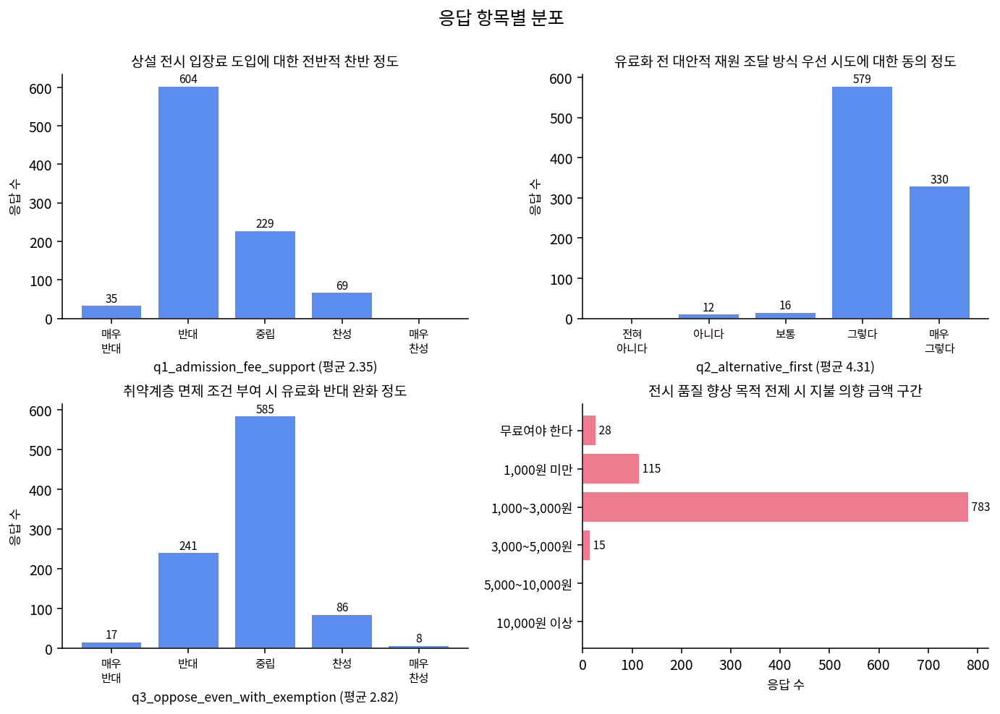
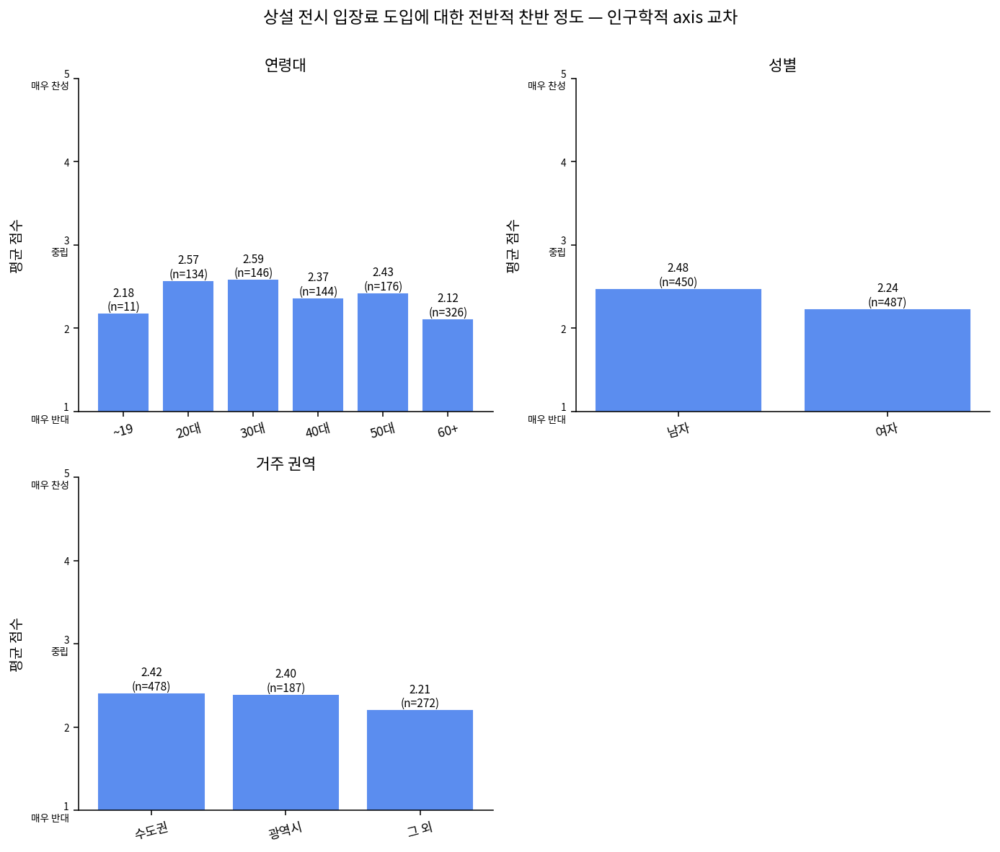
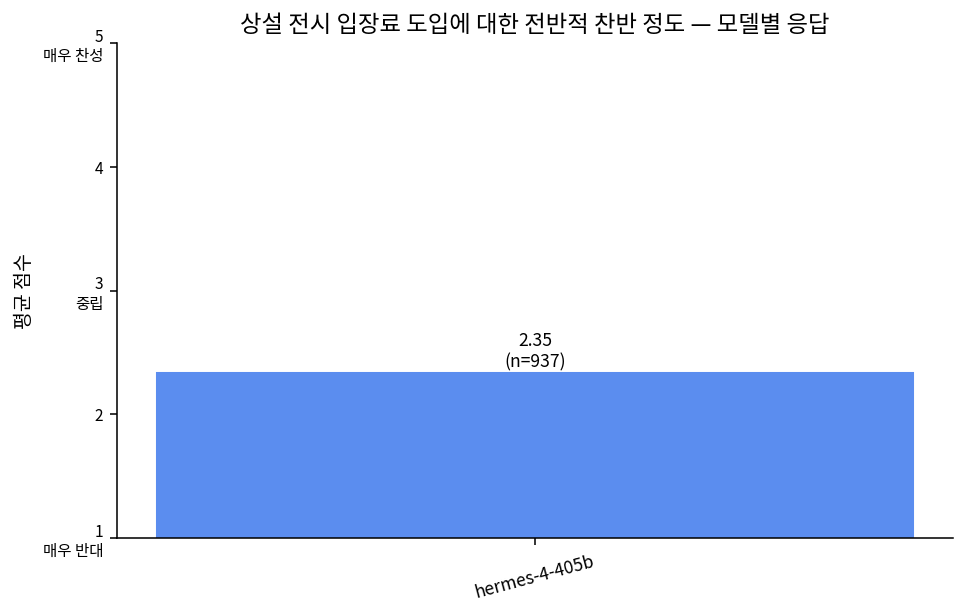

# knowing-koreans · 시뮬레이션 분석 보고서

**시나리오**: 서울 용산 국립중앙박물관의 관람객이 늘어나면서 유료화 논쟁이 격렬해졌다. “입장료를 받아 세금 투입을 줄이고…
**측정일**: 2026-05-01
**규모**: AI 페르소나 1000명 × 1개 모델 → 응답 1000건

본 보고서는 응답자 속성(연령·학력·지역·성별·혼인 등)을 분류 축으로 작성되었습니다. AI 응답을 정확도 예측이 아니라 "어떤 응답자 그룹이 어떤 측면에 반응하는가"의 관점·가설 발생 도구로 활용해 주세요.

> ⚠️ **해석 주의**: 본 보고서는 합성 페르소나·LLM 시뮬레이션 결과입니다. 실제 여론이 아니며, "이 모델·이 표본에서는 ~한 신호가 보인다" 정도로만 읽어 주세요.

## 측정 개요

이번 측정에 사용된 자료의 요약입니다. 응답자 속성 분포는 보고서 본문의 축별 분포 표와 함께 읽어 주세요.

| 항목 | 내용 |
|---|---|
| 측정일 | 2026-05-01 00:26 (KST) |
| 시나리오 | 서울 용산 국립중앙박물관의 관람객이 늘어나면서 유료화 논쟁이 격렬해졌다. “입장료를 받아 세금 투입을 줄이고… |
| 페르소나 출처 | NVIDIA Nemotron-Personas-Korea (한국 인구통계 합성 페르소나) |
| 추출 방식 | 시드 고정 무작위 추출 (seed=1273030321) |
| 페르소나 수 | 1000명 |
| 시뮬레이션 모델 수 | 1개 |
| 응답 수 (페르소나 × 모델) | 1000건 |
| 성공 응답 | 998건 (99.8%) |
| 질문 수 | 5개 |
| 성별 분포 | 여자 525명, 남자 475명 |
| 연령대 분포 | 60+ 344명, 50대 184명, 30대 156명, 40대 154명, 20대 148명, ~19 14명 |
| 학력 분포 | 고등학교 346명, 4년제 대학교 270명, 2~3년제 전문대학 140명, 중학교 87명, 초등학교 78명, 대학원 47명, 무학 32명 |
| 혼인 분포 | 배우자있음 580명, 미혼 269명, 사별 91명, 이혼 60명 |

**시뮬레이션 모델 목록:**

- Hermes 4 405B (NousResearch)

**한눈에 보기 — 응답 결과 시각화**









## 핵심 발견

| 발견 | 내용 |
|---|---|
| 01. 전체 응답 분포 | 10개 cluster 전부에서 Q1=2(반대)가 46~67건으로 가장 많고 Q2=4~5(대안 우선 시도 찬성)가 82~94%로 압도적. Q4 지불 의향은 1,000~3,000원 구간이 74~82%로 집중. Q5 자유서술에서는 '취약계층·학생·어르신 무료/할인 필수'(47~68건), '기본 전시 무료 유지 + 특별전·기부 우선'(51~68건)이 공통 키워드로 나타남. |
| 02. 반대 성향과 소액 지불 의향의 ambivalence | Q1=2(반대) 응답자 중 70~87%가 Q4에서 1,000~3,000원 구간을 선택. '기본 무료 원칙'을 주장하면서도 전시 품질 향상이나 국가 재정 부담을 전제로 소액은 수용하는 패턴이 모든 cluster에서 일관되게 관찰됨. 특히 60+ 고연령·고졸 이하 그룹에서 이 ambivalence가 두드러짐. |
| 03. 대안 우선 합의와 취약계층 보호 프레임 | Q2에서 대안 우선(기부·특별전·후원 확대 먼저)에 대한 강한 동의가 cluster 전반에 걸쳐 82~94%. Q5에서는 '취약계층 보호' 키워드가 47~68건씩 반복되며 Q3=3(중립)과 결합되어 ambivalence를 강화. '기본 vs 특별전' 구분 논리도 51~68건으로 안정적으로 등장. |
| 04. 연령·학력·지역별 nuance 차이 | 60+ 고연령 그룹(30~38명/cluster)은 Q1 반대와 Q2 강한 찬성, Q4 소액 지불을 동시에 보이는 ambivalence가 강함. 고학력(대학원·4년제)은 Q1=3(중립) 비율이 높고 '재정 다변화·품질 향상' 긍정 언급이 많음. 지방(전라남·경상남·제주) persona는 '서울 방문 자체가 부담인데 돈까지'라는 접근성 우려를 직접적으로 표현. |
| 05. narrative와 응답의 정합성 및 부정합 | 소박한 일상·가족 돌봄·자연 감상 narrative를 가진 persona는 '취약계층 보호' 강조와 강한 무료 원칙으로 일관. 반면 고궁·미술관·유적지 방문 경험이 많은 persona(c2·c4·c6)에서도 Q1=2(반대)와 기본 무료 주장이 강해 narrative-response 부정합이 관찰됨. 문화 활동 빈도가 낮은 persona는 취약계층 배려를 더 강하게 주장. |
| 06. 약신호와 모델 편향 가능성 | 찬성 논리의 'SNS 사진족 대체' 언급이 전체 4~9건에 불과하고, 해외 사례(루브르 차등 요금, 1~3만 원 수준) 인용은 전무. 이는 모델 생성 응답이 사회적 바람직성 편향(문화 향유권·공공성 강조)으로 균질화되었을 가능성을 시사. N이 작은 고학력·20~30대 그룹 분석은 신호로 보기 어려움. |

## 큐레이터 관점·가설

**1. 도슨트 톤** — 대상: 60+ 고연령·고졸 이하

『어르신과 아이들이 부담 없이 우리 문화유산을 만나는 공간을 함께 지켜주세요. 특별전과 기부로 먼저 품질을 높인 뒤, 정말 필요하다면 2~3천 원 정도의 작은 참여를 생각해 볼 수 있지 않을까요?』 – 소박한 일상과 가족 돌봄 narrative를 존중하는 따뜻하고 공감하는 어조

**2. 포스터 강조점** — 대상: 전체 관람객

메인 카피: "기본은 모두의 것, 특별은 선택의 것" / 서브: "먼저 특별전 확대와 기부 문화를 키운 뒤 논의합시다. 취약계층·학생·어르신은 언제나 무료로" – ambivalence를 수용하면서도 대안 우선 합의를 시각화

**3. 교육 프로그램 주제어** — 대상: 20~40대 수도권·고학력

『기본 vs 특별: 국립중앙박물관 지속가능 재정 모델 워크숍』 – 기능적 구분 논리를 활용해 재정 다변화와 품질 향상을 동시에 논의하는 프로그램. '접근성과 투자 사이 균형' 키워드 강조

**4. 큐레이션 동선** — 대상: 지방·60+ 여성 관람객

입구 → '우리 문화는 국민 공동재산' 스토리텔링 코너(취약계층 보호 강조) → 중간 '기부 한 걸음으로 전시가 빛납니다' 참여형 기부 스테이션 → 특별전 구역(유료 전환 가능성 암시)으로 이어지는 동선. 지방 방문객의 접근성 우려를 먼저 해소

**5. SNS 카피** — 대상: 50~60대 여성

"아파트 관리비도 부담인데… 그래도 우리 아이들과 어르신들이 마음 편히 문화유산을 만날 수 있다면, 2천 원쯤은 함께 나눌 수 있지 않을까요?" – ambivalence를 그대로 담아 공감 유발

## 응답 — 응답자 속성 축별 분포

각 질문에 대해 응답자 속성 축(전체·수도권/비수도권·연령대·학력·성별·혼인 상태)별로 응답이 어떻게 갈리는지 정리한 표입니다. 표본이 작은 그룹은 신호로 보기 어려우니 함께 표시되는 응답수를 같이 봐 주세요.

## 1. 국립중앙박물관 상설 전시에 입장료를 도입하는 것에 대해 전반적으로 어떻게 생각하십니까?

_1~5 Likert (1=매우 반대, 3=중립, 5=매우 찬성)_

### 전체 분포

| 응답자 속성 | 응답수 | 평균 | 표준편차 | 1 | 2 | 3 | 4 | 5 |
|---|---:|---:|---:|---:|---:|---:|---:|---:|
| 전체 | 937 | 2.35 | 0.67 | 35 | 604 | 229 | 69 | 0 |

### 수도권 vs 비수도권

| 응답자 속성 | 응답수 | 평균 | 표준편차 | 1 | 2 | 3 | 4 | 5 |
|---|---:|---:|---:|---:|---:|---:|---:|---:|
| 비수도권 | 459 | 2.29 | 0.67 | 25 | 309 | 93 | 32 | 0 |
| 수도권 | 478 | 2.42 | 0.66 | 10 | 295 | 136 | 37 | 0 |

### 연령대별

| 응답자 속성 | 응답수 | 평균 | 표준편차 | 1 | 2 | 3 | 4 | 5 |
|---|---:|---:|---:|---:|---:|---:|---:|---:|
| 20대 | 134 | 2.57 | 0.66 | 0 | 70 | 51 | 13 | 0 |
| 30대 | 146 | 2.59 | 0.69 | 0 | 77 | 52 | 17 | 0 |
| 40대 | 144 | 2.37 | 0.61 | 1 | 98 | 36 | 9 | 0 |
| 50대 | 176 | 2.43 | 0.66 | 3 | 109 | 50 | 14 | 0 |
| 60+ | 326 | 2.12 | 0.63 | 31 | 241 | 38 | 16 | 0 |
| ~19 | 11 | 2.18 | 0.40 | 0 | 9 | 2 | 0 | 0 |

### 학력별

| 응답자 속성 | 응답수 | 평균 | 표준편차 | 1 | 2 | 3 | 4 | 5 |
|---|---:|---:|---:|---:|---:|---:|---:|---:|
| 2~3년제 전문대학 | 131 | 2.40 | 0.60 | 0 | 86 | 37 | 8 | 0 |
| 4년제 대학교 | 250 | 2.62 | 0.68 | 1 | 120 | 101 | 28 | 0 |
| 고등학교 | 328 | 2.28 | 0.59 | 5 | 245 | 59 | 19 | 0 |
| 대학원 | 45 | 2.76 | 0.71 | 0 | 18 | 20 | 7 | 0 |
| 무학 | 30 | 1.70 | 0.53 | 10 | 19 | 1 | 0 | 0 |
| 중학교 | 83 | 2.04 | 0.55 | 9 | 64 | 8 | 2 | 0 |
| 초등학교 | 70 | 2.04 | 0.69 | 10 | 52 | 3 | 5 | 0 |

### 성별

| 응답자 속성 | 응답수 | 평균 | 표준편차 | 1 | 2 | 3 | 4 | 5 |
|---|---:|---:|---:|---:|---:|---:|---:|---:|
| 남자 | 450 | 2.48 | 0.68 | 5 | 267 | 135 | 43 | 0 |
| 여자 | 487 | 2.24 | 0.64 | 30 | 337 | 94 | 26 | 0 |

### 혼인 상태별

| 응답자 속성 | 응답수 | 평균 | 표준편차 | 1 | 2 | 3 | 4 | 5 |
|---|---:|---:|---:|---:|---:|---:|---:|---:|
| 미혼 | 242 | 2.50 | 0.65 | 0 | 140 | 82 | 20 | 0 |
| 배우자있음 | 549 | 2.34 | 0.66 | 21 | 360 | 130 | 38 | 0 |
| 사별 | 87 | 2.05 | 0.68 | 14 | 59 | 10 | 4 | 0 |
| 이혼 | 59 | 2.36 | 0.69 | 0 | 45 | 7 | 7 | 0 |

## 2. 입장료 도입 전에 유료 특별전 확대나 기부금 유치 같은 대안적 재원 조달 방식을 먼저 시도해야 한다고 생각하십니까?

_1~5 Likert (1=전혀 그렇지 않다, 3=보통, 5=매우 그렇다)_

### 전체 분포

| 응답자 속성 | 응답수 | 평균 | 표준편차 | 1 | 2 | 3 | 4 | 5 |
|---|---:|---:|---:|---:|---:|---:|---:|---:|
| 전체 | 937 | 4.31 | 0.57 | 0 | 12 | 16 | 579 | 330 |

### 수도권 vs 비수도권

| 응답자 속성 | 응답수 | 평균 | 표준편차 | 1 | 2 | 3 | 4 | 5 |
|---|---:|---:|---:|---:|---:|---:|---:|---:|
| 비수도권 | 459 | 4.31 | 0.58 | 0 | 7 | 8 | 280 | 164 |
| 수도권 | 478 | 4.31 | 0.56 | 0 | 5 | 8 | 299 | 166 |

### 연령대별

| 응답자 속성 | 응답수 | 평균 | 표준편차 | 1 | 2 | 3 | 4 | 5 |
|---|---:|---:|---:|---:|---:|---:|---:|---:|
| 20대 | 134 | 4.20 | 0.56 | 0 | 2 | 4 | 93 | 35 |
| 30대 | 146 | 4.34 | 0.55 | 0 | 1 | 3 | 88 | 54 |
| 40대 | 144 | 4.28 | 0.51 | 0 | 1 | 1 | 98 | 44 |
| 50대 | 176 | 4.34 | 0.51 | 0 | 0 | 3 | 111 | 62 |
| 60+ | 326 | 4.34 | 0.64 | 0 | 8 | 5 | 180 | 133 |
| ~19 | 11 | 4.18 | 0.40 | 0 | 0 | 0 | 9 | 2 |

### 학력별

| 응답자 속성 | 응답수 | 평균 | 표준편차 | 1 | 2 | 3 | 4 | 5 |
|---|---:|---:|---:|---:|---:|---:|---:|---:|
| 2~3년제 전문대학 | 131 | 4.23 | 0.44 | 0 | 0 | 1 | 99 | 31 |
| 4년제 대학교 | 250 | 4.34 | 0.59 | 0 | 4 | 4 | 145 | 97 |
| 고등학교 | 328 | 4.23 | 0.52 | 0 | 3 | 6 | 230 | 89 |
| 대학원 | 45 | 4.42 | 0.78 | 0 | 2 | 2 | 16 | 25 |
| 무학 | 30 | 4.63 | 0.49 | 0 | 0 | 0 | 11 | 19 |
| 중학교 | 83 | 4.43 | 0.59 | 0 | 1 | 1 | 42 | 39 |
| 초등학교 | 70 | 4.34 | 0.68 | 0 | 2 | 2 | 36 | 30 |

### 성별

| 응답자 속성 | 응답수 | 평균 | 표준편차 | 1 | 2 | 3 | 4 | 5 |
|---|---:|---:|---:|---:|---:|---:|---:|---:|
| 남자 | 450 | 4.21 | 0.54 | 0 | 6 | 11 | 315 | 118 |
| 여자 | 487 | 4.40 | 0.58 | 0 | 6 | 5 | 264 | 212 |

### 혼인 상태별

| 응답자 속성 | 응답수 | 평균 | 표준편차 | 1 | 2 | 3 | 4 | 5 |
|---|---:|---:|---:|---:|---:|---:|---:|---:|
| 미혼 | 242 | 4.23 | 0.51 | 0 | 2 | 4 | 173 | 63 |
| 배우자있음 | 549 | 4.32 | 0.58 | 0 | 7 | 10 | 333 | 199 |
| 사별 | 87 | 4.48 | 0.64 | 0 | 2 | 1 | 37 | 47 |
| 이혼 | 59 | 4.31 | 0.59 | 0 | 1 | 1 | 36 | 21 |

## 3. 만약 입장료가 도입된다면, 저소득층·학생·장애인 등 취약계층에 대한 무료 또는 할인 혜택이 충분히 보장된다는 조건 하에서도 유료화에 반대하십니까?

_1~5 Likert (1=여전히 강하게 반대, 3=중립, 5=조건부 찬성으로 입장 변화)_

### 전체 분포

| 응답자 속성 | 응답수 | 평균 | 표준편차 | 1 | 2 | 3 | 4 | 5 |
|---|---:|---:|---:|---:|---:|---:|---:|---:|
| 전체 | 937 | 2.82 | 0.65 | 17 | 241 | 585 | 86 | 8 |

### 수도권 vs 비수도권

| 응답자 속성 | 응답수 | 평균 | 표준편차 | 1 | 2 | 3 | 4 | 5 |
|---|---:|---:|---:|---:|---:|---:|---:|---:|
| 비수도권 | 459 | 2.76 | 0.66 | 12 | 130 | 277 | 38 | 2 |
| 수도권 | 478 | 2.87 | 0.64 | 5 | 111 | 308 | 48 | 6 |

### 연령대별

| 응답자 속성 | 응답수 | 평균 | 표준편차 | 1 | 2 | 3 | 4 | 5 |
|---|---:|---:|---:|---:|---:|---:|---:|---:|
| 20대 | 134 | 2.88 | 0.58 | 0 | 30 | 91 | 12 | 1 |
| 30대 | 146 | 2.92 | 0.64 | 0 | 35 | 88 | 22 | 1 |
| 40대 | 144 | 2.83 | 0.56 | 1 | 33 | 101 | 8 | 1 |
| 50대 | 176 | 2.85 | 0.64 | 1 | 46 | 110 | 17 | 2 |
| 60+ | 326 | 2.71 | 0.72 | 15 | 97 | 184 | 27 | 3 |
| ~19 | 11 | 3.00 | 0.00 | 0 | 0 | 11 | 0 | 0 |

### 학력별

| 응답자 속성 | 응답수 | 평균 | 표준편차 | 1 | 2 | 3 | 4 | 5 |
|---|---:|---:|---:|---:|---:|---:|---:|---:|
| 2~3년제 전문대학 | 131 | 2.81 | 0.56 | 0 | 35 | 86 | 10 | 0 |
| 4년제 대학교 | 250 | 2.93 | 0.63 | 1 | 52 | 163 | 31 | 3 |
| 고등학교 | 328 | 2.83 | 0.57 | 2 | 77 | 226 | 21 | 2 |
| 대학원 | 45 | 3.11 | 0.88 | 0 | 12 | 19 | 11 | 3 |
| 무학 | 30 | 2.30 | 0.92 | 7 | 9 | 12 | 2 | 0 |
| 중학교 | 83 | 2.65 | 0.71 | 3 | 31 | 41 | 8 | 0 |
| 초등학교 | 70 | 2.57 | 0.67 | 4 | 25 | 38 | 3 | 0 |

### 성별

| 응답자 속성 | 응답수 | 평균 | 표준편차 | 1 | 2 | 3 | 4 | 5 |
|---|---:|---:|---:|---:|---:|---:|---:|---:|
| 남자 | 450 | 2.91 | 0.65 | 4 | 98 | 292 | 48 | 8 |
| 여자 | 487 | 2.73 | 0.64 | 13 | 143 | 293 | 38 | 0 |

### 혼인 상태별

| 응답자 속성 | 응답수 | 평균 | 표준편차 | 1 | 2 | 3 | 4 | 5 |
|---|---:|---:|---:|---:|---:|---:|---:|---:|
| 미혼 | 242 | 2.88 | 0.59 | 0 | 56 | 163 | 20 | 3 |
| 배우자있음 | 549 | 2.83 | 0.65 | 11 | 135 | 344 | 55 | 4 |
| 사별 | 87 | 2.55 | 0.76 | 6 | 35 | 38 | 8 | 0 |
| 이혼 | 59 | 2.83 | 0.59 | 0 | 15 | 40 | 3 | 1 |

## 4. 입장료 수익이 전시 품질 향상, 유물 보존, 해외 전시 유치 등에 직접 사용된다면 기꺼이 지불할 의향이 있는 적정 금액은 얼마입니까?

_옵션: 무료여야 한다, 1,000원 미만, 1,000~3,000원, 3,000~5,000원, 5,000~10,000원, 10,000원 이상_

### 전체 분포

| 응답자 속성 | 응답수 | 무료여야 한다 | 1,000원 미만 | 1,000~3,000원 | 3,000~5,000원 | 5,000~10,000원 | 10,000원 이상 |
|---|---:|---:|---:|---:|---:|---:|---:|
| 전체 | 941 | 28 | 115 | 783 | 15 | 0 | 0 |

### 수도권 vs 비수도권

| 응답자 속성 | 응답수 | 무료여야 한다 | 1,000원 미만 | 1,000~3,000원 | 3,000~5,000원 | 5,000~10,000원 | 10,000원 이상 |
|---|---:|---:|---:|---:|---:|---:|---:|
| 비수도권 | 461 | 19 | 74 | 364 | 4 | 0 | 0 |
| 수도권 | 480 | 9 | 41 | 419 | 11 | 0 | 0 |

### 연령대별

| 응답자 속성 | 응답수 | 무료여야 한다 | 1,000원 미만 | 1,000~3,000원 | 3,000~5,000원 | 5,000~10,000원 | 10,000원 이상 |
|---|---:|---:|---:|---:|---:|---:|---:|
| 20대 | 134 | 0 | 4 | 127 | 3 | 0 | 0 |
| 30대 | 146 | 0 | 2 | 139 | 5 | 0 | 0 |
| 40대 | 146 | 1 | 5 | 136 | 4 | 0 | 0 |
| 50대 | 177 | 2 | 13 | 161 | 1 | 0 | 0 |
| 60+ | 327 | 25 | 91 | 209 | 2 | 0 | 0 |
| ~19 | 11 | 0 | 0 | 11 | 0 | 0 | 0 |

### 학력별

| 응답자 속성 | 응답수 | 무료여야 한다 | 1,000원 미만 | 1,000~3,000원 | 3,000~5,000원 | 5,000~10,000원 | 10,000원 이상 |
|---|---:|---:|---:|---:|---:|---:|---:|
| 2~3년제 전문대학 | 133 | 0 | 3 | 129 | 1 | 0 | 0 |
| 4년제 대학교 | 250 | 1 | 3 | 238 | 8 | 0 | 0 |
| 고등학교 | 328 | 4 | 33 | 290 | 1 | 0 | 0 |
| 대학원 | 45 | 0 | 2 | 38 | 5 | 0 | 0 |
| 무학 | 30 | 9 | 12 | 9 | 0 | 0 | 0 |
| 중학교 | 83 | 6 | 28 | 49 | 0 | 0 | 0 |
| 초등학교 | 72 | 8 | 34 | 30 | 0 | 0 | 0 |

### 성별

| 응답자 속성 | 응답수 | 무료여야 한다 | 1,000원 미만 | 1,000~3,000원 | 3,000~5,000원 | 5,000~10,000원 | 10,000원 이상 |
|---|---:|---:|---:|---:|---:|---:|---:|
| 남자 | 452 | 4 | 32 | 404 | 12 | 0 | 0 |
| 여자 | 489 | 24 | 83 | 379 | 3 | 0 | 0 |

### 혼인 상태별

| 응답자 속성 | 응답수 | 무료여야 한다 | 1,000원 미만 | 1,000~3,000원 | 3,000~5,000원 | 5,000~10,000원 | 10,000원 이상 |
|---|---:|---:|---:|---:|---:|---:|---:|
| 미혼 | 243 | 0 | 8 | 229 | 6 | 0 | 0 |
| 배우자있음 | 552 | 17 | 60 | 467 | 8 | 0 | 0 |
| 사별 | 87 | 11 | 39 | 37 | 0 | 0 | 0 |
| 이혼 | 59 | 0 | 8 | 50 | 1 | 0 | 0 |

## 곱씹을 만한 응답

**(Hermes 4 405B · 60대 여성 · 전라남 · 초등학교 · 사별 · 무직)**

> 저희 같은 촌에 사는 노인들은 서울 가는 것 자체가 힘이 드는 일인데, 돈까지 내고 들어가라고 하면 더 안 갈 것 같아요.

_지방 고령층의 접근성 우려를 가장 직설적으로 보여주는 인용. 포스터나 도슨트에서 '서울까지 오는 여정 자체를 존중하는' 메시지로 활용 가능. ambivalence(반대하면서도 Q4 소액 선택)도 동시에 관찰됨._

**(Hermes 4 405B · 60대 여성 · 서울 · 무학 · 건물 청소원)**

> 평생 공짜로 다녔으니 돈 내기는 싫은데… 먼저 다른 방법을 찾아보는 게 맞다고 생각합니다.

_60+ 저학력 여성 다수에서 반복되는 '대안 우선 + 무료 원칙' ambivalence의 전형. 교육 프로그램에서 '기부·특별전 먼저' 워크숍 주제로 직접 연결할 수 있음._

**(Hermes 4 405B · 60대 여성 · 경기 · 고등학교 · 무직)**

> 우리나라 문화유산을 국민 모두가 무료로 볼 수 있어야 한다고 생각해요. … 1,000~3,000원 정도는 부담해볼 수 있어요.

_가장 빈번한 ambivalence 패턴(Q1=2 반대 + Q4 소액 수용)을 압축. 큐레이터는 이 '조건부 수용' 태도를 기부 참여 스토리텔링의 출발점으로 삼을 수 있음._

## 다음에 던져볼 질문·가설

- 실제 관람객(특히 SNS 사진 목적 방문객)에게서 나타나는 '진지 관람층 vs 사진족' 갈등은 모델 생성 페르소나에서 거의 관찰되지 않았는데, 이는 사회적 바람직성 편향 때문인가? 실제 현장 설문에서는 어떤가?
- 60+ 저학력 그룹이 강하게 주장하는 '우리 세대는 공짜로 누렸으니 다음 세대도' 감정적 프레임과, 20~30대가 제시하는 '기본 vs 특별' 기능적 구분 논리를 어떻게 교육 프로그램으로 연결할 수 있는가?
- '기부·특별전 우선'에 대한 원칙적 합의는 높지만 구체적 실행 방안(영국 대영박물관식 기부금 모델, 기업 후원 구조 등)에 대한 상상력은 제한적인데, 이를 보완할 수 있는 참여형 전시나 워크숍 형태는 무엇인가?
- 지방 거주 고령층의 '서울 방문 자체가 부담' 우려를 해소하기 위해 교통 할인과 입장 정책을 연계한 패키지 상품을 도입한다면 수용도는 어떻게 변할 것인가?
- 모델이 과도하게 '공공성·접근성' 프레임으로 응답을 균질화한 것으로 보이는데, 실제 다양한 경제수준·문화소비 패턴을 가진 시민 패널을 구성해 동일 질문을 던진다면 ambivalence 패턴에 어떤 변화가 나타날까?


---

## 부록

### 부록 A — 원본 질문 및 응답 스키마

**질문 (큐레이터 입력 그대로):**

1) 국립중앙박물관 상설 전시에 입장료를 도입하는 것에 대해 전반적으로 어떻게 생각하십니까?
2) 입장료 도입 전에 유료 특별전 확대나 기부금 유치 같은 대안적 재원 조달 방식을 먼저 시도해야 한다고 생각하십니까?
3) 만약 입장료가 도입된다면, 저소득층·학생·장애인 등 취약계층에 대한 무료 또는 할인 혜택이 충분히 보장된다는 조건 하에서도 유료화에 반대하십니까?
4) 입장료 수익이 전시 품질 향상, 유물 보존, 해외 전시 유치 등에 직접 사용된다면 기꺼이 지불할 의향이 있는 적정 금액은 얼마입니까?
5) 국립중앙박물관 유료화에 대한 본인의 입장을 한 문장으로 표현해 주세요.

**응답 JSON 스키마:**

```json
{
  "q1_admission_fee_support": {
    "type": "integer",
    "scale": "1~5 Likert (1=매우 반대, 3=중립, 5=매우 찬성)",
    "description": "상설 전시 입장료 도입에 대한 전반적 찬반 정도"
  },
  "q2_alternative_first": {
    "type": "integer",
    "scale": "1~5 Likert (1=전혀 그렇지 않다, 3=보통, 5=매우 그렇다)",
    "description": "유료화 전 대안적 재원 조달 방식 우선 시도에 대한 동의 정도"
  },
  "q3_oppose_even_with_exemption": {
    "type": "integer",
    "scale": "1~5 Likert (1=여전히 강하게 반대, 3=중립, 5=조건부 찬성으로 입장 변화)",
    "description": "취약계층 면제 조건 부여 시 유료화 반대 완화 정도"
  },
  "q4_willingness_to_pay": {
    "type": "string",
    "options": ["무료여야 한다", "1,000원 미만", "1,000~3,000원", "3,000~5,000원", "5,000~10,000원", "10,000원 이상"],
    "description": "전시 품질 향상 목적 전제 시 지불 의향 금액 구간"
  },
  "q5_open_opinion": {
    "type": "string",
    "max_length": 200,
    "min_length": 50,
    "description": "유료화에 대한 본인 입장을 담은 자유 서술 (50~200자)"
  }
}
```

### 부록 B — 측정 명세

| 항목 | 내용 |
|---|---|
| run_id | `20260501-002643-8c5981` |
| 질문 생성 모델 | Claude Sonnet 4.6 (Anthropic) |
| 보고서 생성 모델 | openrouter/x-ai/grok-4.20 |
| 시드 | 1273030321 |
| 필터 | 없음 (전체 페르소나 풀) |

### 부록 C — 원본 컨텍스트

<details>
<summary>LLM에 주입한 컨텍스트 (클릭하여 펼치기)</summary>

국립중앙박물관은 서울 용산에 위치한 대한민국 대표 국립문화기관으로, 상설 전시를 무료로 운영하며 연간 수백만 명의 관람객이 방문한다. 박물관 운영에 필요한 재원의 대부분은 정부 예산으로 충당되며, 자체 수익은 전체 운영비 대비 매우 낮은 비율을 차지한다. 이러한 재정 구조 속에서 전시 품질 향상, 유물 보존, 학술 연구 등에 필요한 투자를 어떻게 확보할 것인지에 대한 논의가 이어지고 있다.

한편으로는 국립박물관이 국민 누구나 문화유산을 접할 수 있는 공공 인프라라는 점에서, 입장료 도입이 저소득층·학생 등 취약계층의 문화 접근성을 저해할 수 있다는 우려도 존재한다. 반면 해외 주요 박물관들은 유료 입장, 유료 특별전, 기부금 유치 등 다양한 방식으로 재원을 다변화하고 있으며, 이를 통해 전시 수준과 공공성을 동시에 유지하려는 시도를 하고 있다.

당신은 국립중앙박물관을 방문한 경험이 있거나 방문을 고려해 본 적 있는 일반 시민입니다. 아래 질문들은 박물관 입장료 및 재원 조달 방식에 관한 당신의 생각과 경험을 묻는 것입니다. 솔직하고 자유롭게 답해 주세요.

</details>
