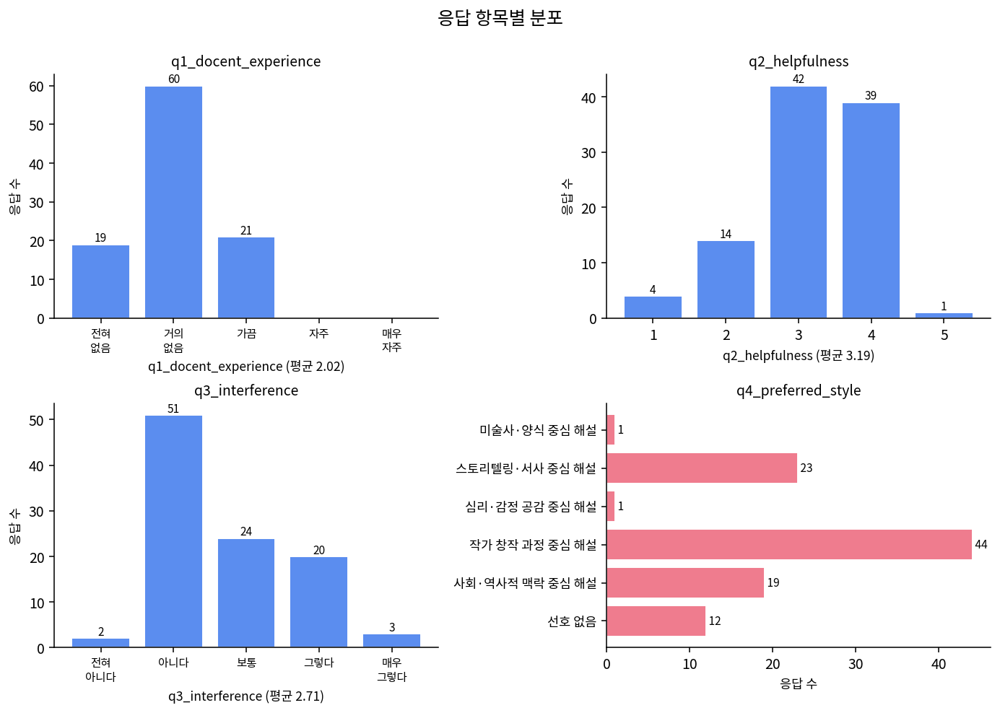
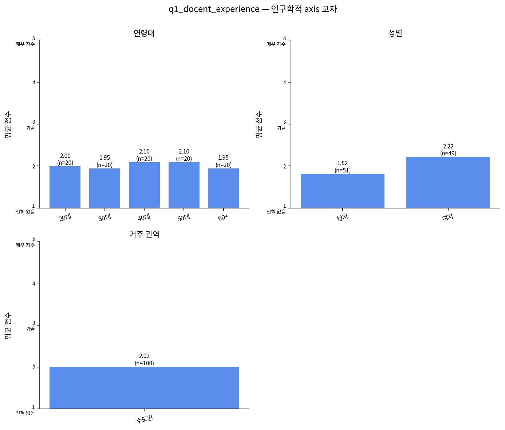
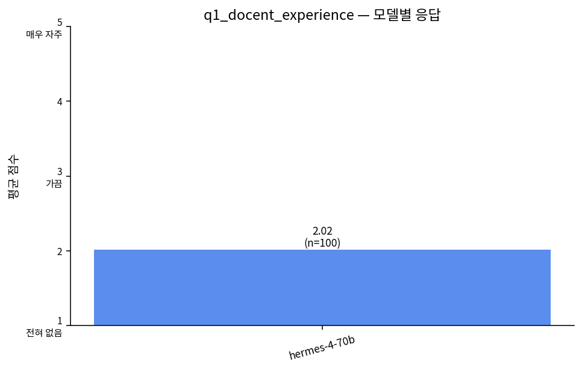

# knowing-koreans · 시뮬레이션 분석 보고서

**시나리오**: 2010년대 중반 이후 미술전시에서 전시를 해설하는 도슨트가 비교적 활발히 활동하고 있다. 도슨트는 2000…
**측정일**: 2026-05-03
**규모**: AI 페르소나 100명 × 1개 모델 → 응답 100건

본 보고서는 응답자 속성(연령·학력·지역·성별·혼인 등)을 분류 축으로 작성되었습니다. AI 응답을 정확도 예측이 아니라 "어떤 응답자 그룹이 어떤 측면에 반응하는가"의 관점·가설 발생 도구로 활용해 주세요.

> ⚠️ **해석 주의**: 본 보고서는 합성 페르소나·LLM 시뮬레이션 결과입니다. 실제 여론이 아니며, "이 모델·이 표본에서는 ~한 신호가 보인다" 정도로만 읽어 주세요.

## 측정 개요

이번 측정에 사용된 자료의 요약입니다. 응답자 속성 분포는 보고서 본문의 축별 분포 표와 함께 읽어 주세요.

| 항목 | 내용 |
|---|---|
| 측정일 | 2026-05-03 04:15 (KST) |
| 시나리오 | 2010년대 중반 이후 미술전시에서 전시를 해설하는 도슨트가 비교적 활발히 활동하고 있다. 도슨트는 2000… |
| 페르소나 출처 | NVIDIA Nemotron-Personas-Korea (한국 인구통계 합성 페르소나) |
| 추출 방식 | 시드 고정 무작위 추출 (seed=1147996316) |
| 페르소나 수 | 100명 |
| 시뮬레이션 모델 수 | 1개 |
| 응답 수 (페르소나 × 모델) | 100건 |
| 성공 응답 | 100건 (100.0%) |
| 질문 수 | 5개 |
| 성별 분포 | 남자 51명, 여자 49명 |
| 연령대 분포 | 20대 20명, 50대 20명, 40대 20명, 30대 20명, 60+ 20명 |
| 학력 분포 | 4년제 대학교 41명, 고등학교 24명, 2~3년제 전문대학 18명, 대학원 6명, 중학교 6명, 초등학교 5명 |
| 혼인 분포 | 배우자있음 58명, 미혼 36명, 사별 4명, 이혼 2명 |

**시뮬레이션 모델 목록:**

- Hermes 4 70B (NousResearch)

**한눈에 보기 — 응답 결과 시각화**









## 핵심 발견

| 발견 | 내용 |
|---|---|
| 01. 전체 응답 분포 | Hermes 4 70B·N=100 표본에서 Q2(도움 됨)는 코드3(보통)이 42건, 코드4(도움)가 39건으로 중앙값이 '보통~도움'에 몰렸고, Q3(방해된다)은 코드2가 51건·코드3이 24건·코드4가 20건으로 '약간 방해'쪽 롱테일이 두텁다. Q1(이용 경험)은 코드2(가끔)가 60건으로 압도적이라, '가끔 들어봤고, 도움은 되지만 내 감상을 덮을까 걱정하는' 중간지대가 이 모델이 그린 기본 정서다. |
| 02. 선호 해설 스타일의 쏠림 | Q4에서 '작가 창작 과정 중심 해설'이 44건으로 1위, '스토리텔링·서사 중심'이 23건, '사회·역사적 맥락 중심'이 19건 순이다. 반면 '미술사·양식 중심'은 1건, '심리·감정 공감 중심'도 1건으로 사실상 사라졌다. 이 모델은 '작가의 의도·제작 과정'이라는 안전하고 중립적인 답을 과도하게 선택하는 균질화 경향을 보이며, 전통적 미술사 계보 해설은 표본 내에서 거의 수요가 없는 것처럼 과소 대표됐을 가능성이 있다. |
| 03. 정량-자유서술 간 ambivalence | Q2·Q3 점수가 낮게 나온 응답자들(Q2=2, Q3=4 이상) 중 상당수가 자유서술에는 '작가 배경은 알고 싶다', '배경 스토리는 재미있다' 같은 긍정 단어를 끼워 넣는다. 예: 전직 산업안전원·20대 남성은 Q3=4(방해)로 찍으면서도 '작품 제작 과정을 배우는 건 유익'이라고 적는다. 즉 '도슨트 일반'에 대한 거부감과 '작가 서사 정보'에 대한 수요가 분리돼 있으며, 응답자는 전자를 낮게 후자를 높게 평가하는 분열된 태도를 보인다. |
| 04. 응답자 속성별 온도차 | 표본 내에서 60대 이상 남성(특히 초등·중학교 학력)은 Q3=4~5(방해)와 '선호 없음'을 고르는 빈도가 눈에 띄고(예: 60+ 초등 사별 남성, 60+ 중학교 남성), 자유서술도 '그림은 눈으로 보는 것'이라는 자기 감상 우선 논리다. 반면 30~40대 여성 대졸·전문직(의사, 치과위생사, 유치원 원장, 광고 전문가)은 Q2=3~4 / Q3=2로 '도움-비방해'의 정석 패턴을 유지한다. 다만 해당 응답자 그룹은 각 N이 3~10명 수준이라 신호로 보기 어렵고, 경향성 정도로만 읽어야 한다. |
| 05. 구직자·무직 응답자에서 드러난 거부감 | 전직 산업안전원·전직 도로운송 사무원·전직 시설 경비원 등 '구직 중' 페르소나, 그리고 40대 미혼 무직 남성 페르소나에서 Q3=4~5의 강한 방해감과 '선호 없음' 응답이 반복된다. '작품 앞에서 혼자 생각할 시간이 가장 소중하다'(전직 도로운송 사무원·20대 남성·고졸)는 식의 표현이 이 응답자 그룹에 몰리는데, 도슨트라는 '해석 권력'에 대한 반감이 경제적 주변화의 정서와 겹쳐 표현되는지 추가 관찰이 필요하다. |
| 06. 직업 서사와 해설 스타일 선호의 공명 | 전통 건축가(20대 남성·4년제)는 '한옥의 철학을 전달하듯 작품 배후 서사를 설명해야 한다', 변호사(40대 남성·대학원)는 '심리·감정 공감 중심'(전체에서 단 1건)을 선택하며 의뢰인 공감 능력 서사와 겹친다. 해외 영업원(50대 남성·대학원)과 소방설계기술자(20대 남성)는 '객관적 정보 전달'·'작품의 구조적·기술적 배경'을 강조한다. 이 모델은 페르소나의 직업 서사를 해설 스타일 취향 언어로 꽤 일관되게 치환하고 있어, 큐레이션 카피를 '직업 페르소나별 맞춤 훅'으로 설계할 여지가 크다. |
| 07. 반복되는 키워드 군집 | 자유서술에서 가장 자주 재등장하는 표현은 '작가의 창작 배경·의도·제작 과정', '나만의 감상을 방해하지 않는 선', '쉽게 풀어서', '강요하지 말고'이다. 반대로 '도슨트', '스타 도슨트', '공연', '독점성' 같은 시나리오 원문의 찬성측 어휘는 거의 복제되지 않았다. 이 표본은 찬성 프레임보다 반대 프레임(감상 자율성)을 더 강하게 내재화했으며, LLM이 사회적 바람직성 측면에서 '개인 감상 존중'을 기본값으로 삼았을 가능성이 있다. |
| 08. 모델 균질화·사회적 바람직성 신호 | Q5 자유서술 상당수가 '도움은 되지만 나만의 감상을 방해하지 않는 선에서', '객관적 정보와 주관적 감상의 균형' 같은 중립 절충형 문장으로 수렴한다. Hermes 4 70B 이 단일 모델이 만든 한 차례의 표본인 만큼, 이 균형 어법이 한국 관람객의 실제 분포라기보다 모델이 학습한 '온건한 정답' 패턴일 수 있다는 점을 유의해야 한다. |

## 큐레이터 관점·가설

**1. SNS 카피 톤** — 대상: 30~40대 대졸 여성 전문직 (의사·치위생사·광고 전문가·유치원 원장 등)

'작가의 고민, 그 한 붓 뒤의 이야기' 같은 작가 내면 서사 중심 훅을 메인 카피로 쓰되, 말미에 '해석은 관람객 몫'이라는 감상 자율성 보장 문구를 붙인다. 이 응답자 그룹은 Q2=4 / Q3=2 조합을 자주 만들며 '배경 설명은 OK, 강요는 NO' 패턴이 강해, 카피도 정보 제공 + 자율성 보장의 2박자로 짜야 공감을 얻을 가능성이 있다.

**2. 도슨트 톤 / 동선 설계** — 대상: 60대 이상 저학력 남성 (초등·중학교·고졸, 무직·경비·단순 영업)

'해설 없는 방'과 '해설 있는 방'을 공간적으로 분리하고, 해설 방에서도 작가 개인사·시대 배경을 '내 시절 이야기'처럼 구어체로 풀어주는 톤을 준비한다. 이 응답자 그룹은 '선호 없음'과 '방해된다'를 고르는 빈도가 표본 내에서 높지만, 자유서술에서는 '시대 배경은 알고 싶다'는 말이 반복되므로, 강제 동선이 아닌 '선택적 합류' 형식이 더 맞을 가능성이 있다.

**3. 교육 프로그램 주제어** — 대상: 20대 구직자·무직 남성 (고졸·전문대 다수)

'내 해석 먼저, 전문가 해석 나중'을 슬로건으로 한 2부 구성 프로그램을 제안한다. 1부는 해설 없이 20분간 자유 관람, 2부는 도슨트가 '정답'이 아닌 '다른 해석 예시'를 제시하는 포맷이다. 이 응답자 그룹에서 '작품 앞에서 혼자 생각할 시간이 가장 소중하다'(전직 도로운송 사무원·20대 남성·고졸) 같은 강한 자율성 요구가 반복되므로, 해석 권력 대신 해석 레퍼런스로서의 도슨트 포지셔닝이 먹힐 수 있다.

**4. 포스터 강조점** — 대상: 전통 건축가·소방설계·변리사·영업 등 전문 직능 페르소나

'구조·설계·재료로 읽는 그림' 같은 직능 프레임 포스터를 소규모로 A/B 테스트한다. 이 표본에서는 직업 서사가 해설 선호 언어를 물들이는 경향이 뚜렷해(건축가는 철학, 소방·영업은 구조·사실, 변호사는 공감) 포스터 한 장을 하나로 통일하기보다 주간별 테마 포스터를 돌리는 편이 큐레이션 동선에 유리할 수 있다.

**5. 큐레이션 동선 / 교육 프로그램** — 대상: 30대 여성 육아·워킹맘 (치위생사·회계사무원·관세행정·유치원 원장)

'아이와 함께 듣는 10분 도슨트' 같은 짧은 길이·낮은 톤의 해설 세션을 따로 파일럿한다. 이 응답자 그룹은 자유서술에서 '너무 길거나 어려우면 집중하기 어렵다'는 표현이 반복되며, 배달·넷플릭스·웹툰 같은 짧은 호흡 콘텐츠 소비 패턴과 일치한다. 긴 정통 도슨트와 별도로, 압축 포맷을 보조 동선으로 병치하는 실험이 필요하다.

## 응답 — 응답자 속성 축별 분포

각 질문에 대해 응답자 속성 축(전체·수도권/비수도권·연령대·학력·성별·혼인 상태)별로 응답이 어떻게 갈리는지 정리한 표입니다. 표본이 작은 그룹은 신호로 보기 어려우니 함께 표시되는 응답수를 같이 봐 주세요.

## 1. 박물관이나 미술관에서 도슨트 해설을 들어본 경험이 있으신가요? 있다면 얼마나 자주 이용하시나요?

_1~5 (1=전혀 없음, 2=1~2회 경험, 3=가끔(연 3~5회), 4=자주(연 6회 이상), 5=거의 매번 이용)_

### 전체 분포

| 응답자 속성 | 응답수 | 평균 | 표준편차 | 1 | 2 | 3 | 4 | 5 |
|---|---:|---:|---:|---:|---:|---:|---:|---:|
| 전체 | 100 | 2.02 | 0.64 | 19 | 60 | 21 | 0 | 0 |

### 수도권 vs 비수도권

| 응답자 속성 | 응답수 | 평균 | 표준편차 | 1 | 2 | 3 | 4 | 5 |
|---|---:|---:|---:|---:|---:|---:|---:|---:|
| 수도권 | 100 | 2.02 | 0.64 | 19 | 60 | 21 | 0 | 0 |

### 연령대별

| 응답자 속성 | 응답수 | 평균 | 표준편차 | 1 | 2 | 3 | 4 | 5 |
|---|---:|---:|---:|---:|---:|---:|---:|---:|
| 20대 | 20 | 2.00 | 0.56 | 3 | 14 | 3 | 0 | 0 |
| 30대 | 20 | 1.95 | 0.60 | 4 | 13 | 3 | 0 | 0 |
| 40대 | 20 | 2.10 | 0.64 | 3 | 12 | 5 | 0 | 0 |
| 50대 | 20 | 2.10 | 0.64 | 3 | 12 | 5 | 0 | 0 |
| 60+ | 20 | 1.95 | 0.76 | 6 | 9 | 5 | 0 | 0 |

### 학력별

| 응답자 속성 | 응답수 | 평균 | 표준편차 | 1 | 2 | 3 | 4 | 5 |
|---|---:|---:|---:|---:|---:|---:|---:|---:|
| 2~3년제 전문대학 | 18 | 1.94 | 0.54 | 3 | 13 | 2 | 0 | 0 |
| 4년제 대학교 | 41 | 2.07 | 0.57 | 5 | 28 | 8 | 0 | 0 |
| 고등학교 | 24 | 1.96 | 0.75 | 7 | 11 | 6 | 0 | 0 |
| 대학원 | 6 | 2.83 | 0.41 | 0 | 1 | 5 | 0 | 0 |
| 중학교 | 6 | 1.67 | 0.52 | 2 | 4 | 0 | 0 | 0 |
| 초등학교 | 5 | 1.60 | 0.55 | 2 | 3 | 0 | 0 | 0 |

### 성별

| 응답자 속성 | 응답수 | 평균 | 표준편차 | 1 | 2 | 3 | 4 | 5 |
|---|---:|---:|---:|---:|---:|---:|---:|---:|
| 남자 | 51 | 1.82 | 0.71 | 18 | 24 | 9 | 0 | 0 |
| 여자 | 49 | 2.22 | 0.47 | 1 | 36 | 12 | 0 | 0 |

### 혼인 상태별

| 응답자 속성 | 응답수 | 평균 | 표준편차 | 1 | 2 | 3 | 4 | 5 |
|---|---:|---:|---:|---:|---:|---:|---:|---:|
| 미혼 | 36 | 2.06 | 0.63 | 6 | 22 | 8 | 0 | 0 |
| 배우자있음 | 58 | 2.00 | 0.62 | 11 | 36 | 11 | 0 | 0 |
| 사별 | 4 | 2.00 | 1.15 | 2 | 0 | 2 | 0 | 0 |
| 이혼 | 2 | 2.00 | 0.00 | 0 | 2 | 0 | 0 | 0 |

## 2. 도슨트 해설이 작품을 이해하고 감상하는 데 도움이 된다고 생각하시나요?

_1~5 Likert (1=전혀 도움이 안 됨 ~ 5=매우 도움이 됨)_

### 전체 분포

| 응답자 속성 | 응답수 | 평균 | 표준편차 | 1 | 2 | 3 | 4 | 5 |
|---|---:|---:|---:|---:|---:|---:|---:|---:|
| 전체 | 100 | 3.19 | 0.84 | 4 | 14 | 42 | 39 | 1 |

### 수도권 vs 비수도권

| 응답자 속성 | 응답수 | 평균 | 표준편차 | 1 | 2 | 3 | 4 | 5 |
|---|---:|---:|---:|---:|---:|---:|---:|---:|
| 수도권 | 100 | 3.19 | 0.84 | 4 | 14 | 42 | 39 | 1 |

### 연령대별

| 응답자 속성 | 응답수 | 평균 | 표준편차 | 1 | 2 | 3 | 4 | 5 |
|---|---:|---:|---:|---:|---:|---:|---:|---:|
| 20대 | 20 | 3.30 | 0.86 | 1 | 2 | 7 | 10 | 0 |
| 30대 | 20 | 3.25 | 0.79 | 1 | 1 | 10 | 8 | 0 |
| 40대 | 20 | 3.15 | 0.75 | 0 | 4 | 9 | 7 | 0 |
| 50대 | 20 | 3.05 | 0.89 | 1 | 4 | 8 | 7 | 0 |
| 60+ | 20 | 3.20 | 0.95 | 1 | 3 | 8 | 7 | 1 |

### 학력별

| 응답자 속성 | 응답수 | 평균 | 표준편차 | 1 | 2 | 3 | 4 | 5 |
|---|---:|---:|---:|---:|---:|---:|---:|---:|
| 2~3년제 전문대학 | 18 | 2.94 | 0.80 | 1 | 3 | 10 | 4 | 0 |
| 4년제 대학교 | 41 | 3.54 | 0.64 | 0 | 3 | 13 | 25 | 0 |
| 고등학교 | 24 | 2.96 | 1.00 | 2 | 5 | 10 | 6 | 1 |
| 대학원 | 6 | 3.67 | 0.52 | 0 | 0 | 2 | 4 | 0 |
| 중학교 | 6 | 2.83 | 0.41 | 0 | 1 | 5 | 0 | 0 |
| 초등학교 | 5 | 2.20 | 0.84 | 1 | 2 | 2 | 0 | 0 |

### 성별

| 응답자 속성 | 응답수 | 평균 | 표준편차 | 1 | 2 | 3 | 4 | 5 |
|---|---:|---:|---:|---:|---:|---:|---:|---:|
| 남자 | 51 | 2.96 | 0.96 | 4 | 12 | 17 | 18 | 0 |
| 여자 | 49 | 3.43 | 0.61 | 0 | 2 | 25 | 21 | 1 |

### 혼인 상태별

| 응답자 속성 | 응답수 | 평균 | 표준편차 | 1 | 2 | 3 | 4 | 5 |
|---|---:|---:|---:|---:|---:|---:|---:|---:|
| 미혼 | 36 | 3.31 | 0.92 | 2 | 5 | 9 | 20 | 0 |
| 배우자있음 | 58 | 3.14 | 0.78 | 2 | 7 | 31 | 17 | 1 |
| 사별 | 4 | 2.75 | 0.96 | 0 | 2 | 1 | 1 | 0 |
| 이혼 | 2 | 3.50 | 0.71 | 0 | 0 | 1 | 1 | 0 |

## 3. 도슨트 해설이 나만의 작품 해석이나 감상을 방해한다고 느낀 적이 있으신가요?

_1~5 Likert (1=전혀 그렇지 않다 ~ 5=매우 그렇다)_

### 전체 분포

| 응답자 속성 | 응답수 | 평균 | 표준편차 | 1 | 2 | 3 | 4 | 5 |
|---|---:|---:|---:|---:|---:|---:|---:|---:|
| 전체 | 100 | 2.71 | 0.91 | 2 | 51 | 24 | 20 | 3 |

### 수도권 vs 비수도권

| 응답자 속성 | 응답수 | 평균 | 표준편차 | 1 | 2 | 3 | 4 | 5 |
|---|---:|---:|---:|---:|---:|---:|---:|---:|
| 수도권 | 100 | 2.71 | 0.91 | 2 | 51 | 24 | 20 | 3 |

### 연령대별

| 응답자 속성 | 응답수 | 평균 | 표준편차 | 1 | 2 | 3 | 4 | 5 |
|---|---:|---:|---:|---:|---:|---:|---:|---:|
| 20대 | 20 | 2.80 | 1.01 | 0 | 11 | 3 | 5 | 1 |
| 30대 | 20 | 2.90 | 0.79 | 0 | 7 | 8 | 5 | 0 |
| 40대 | 20 | 2.60 | 0.82 | 0 | 12 | 4 | 4 | 0 |
| 50대 | 20 | 2.80 | 1.01 | 1 | 8 | 6 | 4 | 1 |
| 60+ | 20 | 2.45 | 0.94 | 1 | 13 | 3 | 2 | 1 |

### 학력별

| 응답자 속성 | 응답수 | 평균 | 표준편차 | 1 | 2 | 3 | 4 | 5 |
|---|---:|---:|---:|---:|---:|---:|---:|---:|
| 2~3년제 전문대학 | 18 | 2.94 | 0.94 | 0 | 8 | 3 | 7 | 0 |
| 4년제 대학교 | 41 | 2.46 | 0.67 | 0 | 26 | 11 | 4 | 0 |
| 고등학교 | 24 | 2.79 | 1.10 | 2 | 9 | 7 | 4 | 2 |
| 대학원 | 6 | 2.17 | 0.41 | 0 | 5 | 1 | 0 | 0 |
| 중학교 | 6 | 3.33 | 0.82 | 0 | 1 | 2 | 3 | 0 |
| 초등학교 | 5 | 3.40 | 1.34 | 0 | 2 | 0 | 2 | 1 |

### 성별

| 응답자 속성 | 응답수 | 평균 | 표준편차 | 1 | 2 | 3 | 4 | 5 |
|---|---:|---:|---:|---:|---:|---:|---:|---:|
| 남자 | 51 | 2.98 | 1.03 | 1 | 21 | 10 | 16 | 3 |
| 여자 | 49 | 2.43 | 0.68 | 1 | 30 | 14 | 4 | 0 |

### 혼인 상태별

| 응답자 속성 | 응답수 | 평균 | 표준편차 | 1 | 2 | 3 | 4 | 5 |
|---|---:|---:|---:|---:|---:|---:|---:|---:|
| 미혼 | 36 | 2.75 | 0.91 | 0 | 19 | 8 | 8 | 1 |
| 배우자있음 | 58 | 2.69 | 0.94 | 2 | 29 | 14 | 11 | 2 |
| 사별 | 4 | 3.00 | 0.82 | 0 | 1 | 2 | 1 | 0 |
| 이혼 | 2 | 2.00 | 0.00 | 0 | 2 | 0 | 0 | 0 |

## 4. 도슨트 해설 방식 중 어떤 스타일을 가장 선호하시나요?

_옵션: 미술사·양식 중심 해설, 스토리텔링·서사 중심 해설, 심리·감정 공감 중심 해설, 작가 창작 과정 중심 해설, 사회·역사적 맥락 중심 해설, 선호 없음_

### 전체 분포

| 응답자 속성 | 응답수 | 미술사·양식 중심 해설 | 스토리텔링·서사 중심 해설 | 심리·감정 공감 중심 해설 | 작가 창작 과정 중심 해설 | 사회·역사적 맥락 중심 해설 | 선호 없음 |
|---|---:|---:|---:|---:|---:|---:|---:|
| 전체 | 100 | 1 | 23 | 1 | 44 | 19 | 12 |

### 수도권 vs 비수도권

| 응답자 속성 | 응답수 | 미술사·양식 중심 해설 | 스토리텔링·서사 중심 해설 | 심리·감정 공감 중심 해설 | 작가 창작 과정 중심 해설 | 사회·역사적 맥락 중심 해설 | 선호 없음 |
|---|---:|---:|---:|---:|---:|---:|---:|
| 수도권 | 100 | 1 | 23 | 1 | 44 | 19 | 12 |

### 연령대별

| 응답자 속성 | 응답수 | 미술사·양식 중심 해설 | 스토리텔링·서사 중심 해설 | 심리·감정 공감 중심 해설 | 작가 창작 과정 중심 해설 | 사회·역사적 맥락 중심 해설 | 선호 없음 |
|---|---:|---:|---:|---:|---:|---:|---:|
| 20대 | 20 | 0 | 7 | 0 | 10 | 1 | 2 |
| 30대 | 20 | 0 | 6 | 0 | 11 | 2 | 1 |
| 40대 | 20 | 0 | 4 | 1 | 8 | 5 | 2 |
| 50대 | 20 | 1 | 2 | 0 | 11 | 2 | 4 |
| 60+ | 20 | 0 | 4 | 0 | 4 | 9 | 3 |

### 학력별

| 응답자 속성 | 응답수 | 미술사·양식 중심 해설 | 스토리텔링·서사 중심 해설 | 심리·감정 공감 중심 해설 | 작가 창작 과정 중심 해설 | 사회·역사적 맥락 중심 해설 | 선호 없음 |
|---|---:|---:|---:|---:|---:|---:|---:|
| 2~3년제 전문대학 | 18 | 0 | 2 | 0 | 8 | 3 | 5 |
| 4년제 대학교 | 41 | 0 | 11 | 0 | 22 | 8 | 0 |
| 고등학교 | 24 | 1 | 7 | 0 | 7 | 6 | 3 |
| 대학원 | 6 | 0 | 0 | 1 | 4 | 1 | 0 |
| 중학교 | 6 | 0 | 2 | 0 | 1 | 1 | 2 |
| 초등학교 | 5 | 0 | 1 | 0 | 2 | 0 | 2 |

### 성별

| 응답자 속성 | 응답수 | 미술사·양식 중심 해설 | 스토리텔링·서사 중심 해설 | 심리·감정 공감 중심 해설 | 작가 창작 과정 중심 해설 | 사회·역사적 맥락 중심 해설 | 선호 없음 |
|---|---:|---:|---:|---:|---:|---:|---:|
| 남자 | 51 | 0 | 4 | 1 | 23 | 12 | 11 |
| 여자 | 49 | 1 | 19 | 0 | 21 | 7 | 1 |

### 혼인 상태별

| 응답자 속성 | 응답수 | 미술사·양식 중심 해설 | 스토리텔링·서사 중심 해설 | 심리·감정 공감 중심 해설 | 작가 창작 과정 중심 해설 | 사회·역사적 맥락 중심 해설 | 선호 없음 |
|---|---:|---:|---:|---:|---:|---:|---:|
| 미혼 | 36 | 1 | 9 | 0 | 19 | 2 | 5 |
| 배우자있음 | 58 | 0 | 14 | 1 | 22 | 14 | 7 |
| 사별 | 4 | 0 | 0 | 0 | 2 | 2 | 0 |
| 이혼 | 2 | 0 | 0 | 0 | 1 | 1 | 0 |

## 곱씹을 만한 응답

**(Hermes 4 70B · 20대 남성 · 서울 · 고졸 · 전직 산업안전원·구직 중)**

> 도슨트 해설이 나만의 생각을 방해하는 건 싫어하지만, 작품 제작 과정을 배우는 건 나름 유익해. 그런데 특정 해석을 강요하는 건 별로야. (Q2=2, Q3=4)

_'도움도 되고 방해도 된다'의 전형. 정량은 부정·자유서술은 조건부 긍정. 도슨트 상품을 '해설' 단일 패키지로 팔면 이 층은 이탈하지만, '제작 과정 정보 카드'와 '해석 강요 없는 10분 투어'로 쪼개면 전환될 가능성이 있다._

**(Hermes 4 70B · 40대 남성 · 서울 · 대학원 · 변호사)**

> 작품 해석에 대한 개방성을 유지하면서도, 해설자의 감성과 통찰이 관람객의 시각을 넓히는 데 초점을 맞추는 것이 중요합니다. (Q4='심리·감정 공감 중심' — 전체 100명 중 이 선택은 2명뿐)

_직업 서사(의뢰인 공감)가 해설 스타일 취향에 그대로 스민 드문 사례. 대다수가 '작가 창작 과정'에 쏠리는 표본에서 이런 소수 선택은 '심리·감정 공감' 계열 도슨트(예: 작가의 우울·상실을 다루는 30분 세션)에 대한 잠재 수요가 존재한다는 단서로 활용할 만하다._

**(Hermes 4 70B · 20대 남성 · 서울 · 고졸 · 전직 도로운송 사무원·구직 중)**

> 작품 앞에서 혼자 생각할 시간이 가장 소중해요. 도슨트 설명은 내 느낌을 방해하곤 해서 전혀 필요 없다고 봅니다. (Q1=1, Q2=1, Q3=5, Q4='선호 없음')

_표본 내에서 가장 극단적인 '감상 자율성' 응답. 이 층을 설득하려는 카피보다, 이 층을 '해설 없는 방'의 주 사용자로 승인하는 공간 전략이 현실적이다. 역으로 이 방에 자리만 내주면, 나중에 '해석 레퍼런스 카드' 한 장으로 끌어들일 접점이 생긴다._

## 다음에 던져볼 질문·가설

- 이번 표본에서 '작가 창작 과정 중심 해설'로 쏠린 44%는 응답자의 실제 취향일까, 아니면 Hermes 4 70B가 가장 '무난한 정답'으로 학습한 지점일까 — 다른 모델(예: Claude·GPT·Qwen) 교차 실행이 필요하다.
- '해설은 도움된다(Q2=4)'와 '해설은 방해된다(Q3=4)'를 동시에 고르는 ambivalent 응답자가 실제 관람객에서도 나타난다면, 이들은 도슨트 이탈층일까 잠재 전환층일까? 현장 인터뷰로 구분 질문을 설계해볼 가치가 있다.
- 60대 이상 저학력 남성 페르소나에서 반복된 '선호 없음 + 방해된다' 패턴은 해설 자체에 대한 거부인지, 한국어 해설 전달 방식(전문 용어·경어체·빠른 속도)에 대한 거부인지 분리해 물어볼 필요가 있다.
- '미술사·양식 중심'과 '심리·감정 공감 중심'이 각 1명으로 거의 소멸한 것은 이 모델의 한계인지, 현실의 한국 관람객도 이 두 스타일을 정말로 낮게 치는지 — 실제 도슨트 프로그램 신청자 로그와 대조해 봐야 한다.
- 페르소나 직업(건축가·변호사·영업원 등)이 해설 스타일 선호 언어에 강하게 스미는 경향이 이 모델의 서사 일관성 탓인지, 실제 관람객도 직업 정체성을 투영해 해설을 고르는지 — '직업별 맞춤 도슨트' 파일럿으로 검증해볼 수 있다.


---

## 부록

### 부록 A — 원본 질문 및 응답 스키마

**질문 (큐레이터 입력 그대로):**

1) 박물관이나 미술관에서 도슨트 해설을 들어본 경험이 있으신가요? 있다면 얼마나 자주 이용하시나요?
2) 도슨트 해설이 작품을 이해하고 감상하는 데 도움이 된다고 생각하시나요?
3) 도슨트 해설이 나만의 작품 해석이나 감상을 방해한다고 느낀 적이 있으신가요?
4) 도슨트 해설 방식 중 어떤 스타일을 가장 선호하시나요?
5) 도슨트 해설에 대해 가장 중요하게 생각하는 점을 자유롭게 말씀해 주세요.

**응답 JSON 스키마:**

```json
{
  "q1_docent_experience": {
    "type": "integer",
    "scale": "1~5 (1=전혀 없음, 2=1~2회 경험, 3=가끔(연 3~5회), 4=자주(연 6회 이상), 5=거의 매번 이용)"
  },
  "q2_helpfulness": {
    "type": "integer",
    "scale": "1~5 Likert (1=전혀 도움이 안 됨 ~ 5=매우 도움이 됨)"
  },
  "q3_interference": {
    "type": "integer",
    "scale": "1~5 Likert (1=전혀 그렇지 않다 ~ 5=매우 그렇다)"
  },
  "q4_preferred_style": {
    "type": "string",
    "enum": [
      "미술사·양식 중심 해설",
      "스토리텔링·서사 중심 해설",
      "심리·감정 공감 중심 해설",
      "작가 창작 과정 중심 해설",
      "사회·역사적 맥락 중심 해설",
      "선호 없음"
    ]
  },
  "q5_free_response": {
    "type": "string",
    "description": "도슨트 해설에서 가장 중요하다고 생각하는 점 (50~200자 이내 자유 응답)"
  }
}
```

### 부록 B — 측정 명세

| 항목 | 내용 |
|---|---|
| run_id | `20260503-041511-08e5b6` |
| 질문 생성 모델 | Claude Sonnet 4.6 (Anthropic) |
| 보고서 생성 모델 | Claude Opus 4.7 (Anthropic) |
| 시드 | 1147996316 |
| 필터 | {'province': '서울', 'age_min': 20, 'age_max': 100, 'stratify_by': 'age_bucket'} |

### 부록 C — 원본 컨텍스트

<details>
<summary>LLM에 주입한 컨텍스트 (클릭하여 펼치기)</summary>

미술관 도슨트(docent)는 전시 작품을 관람객에게 구두로 해설하는 역할을 맡는다. 국내에서는 2000년대 초반 자원봉사자 중심으로 시작되었으나, 이후 전업 도슨트가 등장하고 특정 해설자가 대중적 인지도를 얻는 현상도 나타나고 있다.

도슨트 해설은 작품에 맥락과 서사를 부여해 관람 경험을 풍부하게 한다는 긍정적 시각이 있다. 동일한 작품이라도 해설자의 배경과 관점에 따라 전혀 다른 방식으로 전달될 수 있으며, 이는 전시 공간에서만 누릴 수 있는 고유한 경험으로 여겨지기도 한다.

반면, 미술 감상의 핵심은 관람객 개인이 작품과 직접 마주하며 자신만의 해석을 형성하는 과정이라는 시각도 존재한다. 이 관점에서 도슨트의 설명은 특정 해석을 앞세워 개인의 감상을 제한하거나, 수동적 수용 방식을 강화할 수 있다는 우려가 제기된다.

</details>
